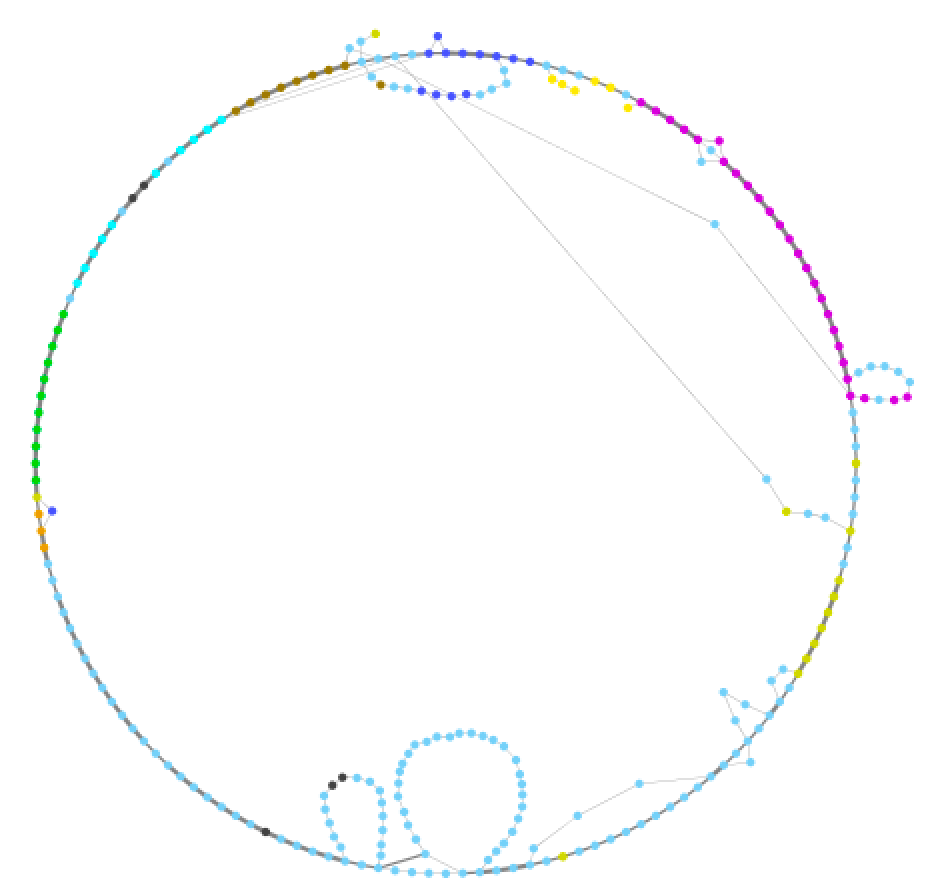

Cytoscape
File -> Import -> Network from file...
choose example.network.out
make sure the "gene1" and "gene2" columns have green or orange circles above them (indicating those are the nodes ot be connected). All other columns are treated as edge annotations.
File -> Import -> Table from file...
choose gene_color_table.txt
Make sure the "node" column is the key node (has a key above it)
You won't see any changes yet until will change the network style.

Click on Edge Table" at the bottom of the main window. Select all nodes in your reference plasmid (in the example choose PlasmidA)
You can do this quickly by clicking on the first edge for PlasmidA, scroll down, then hold shift and click on the last edge for PlasmidA.

Right click and select "Select edges from highlighted rows"
Then in the main menu select:
Select -> Nodes -> Nodes connected by selected edges

You should have a subset of the nodes highlighted in yellow. These are the nodes from PlasmidA.

Select
Layout -> Settings...

In the window that appears, select "Attribute Circle Layout" and make sure the option "Layout only selected nodes:" is selected. Change "circle size" to 600. Click "Apply Layout" to apply the circle layout then click "Done"

Click anywhere in the window to deselect the nodes that are highlighted.

Select
Edit -> Remove Duplicated Edges...
In the window that appears, select the network (example.network.single.out)
And select the options "Ignore edge direction" and  "Create an edge table column with number of duplicate edges" before clicking OK.

In the control panel click the "Style" button. With "Node" selected at the bottom, click the arrow next to "fill Color". Next to "Column" click on the area that says "-- select value --" and change the value to "color" (which is one of the columns from our input table). Change "Mapping Type" to "Passthrough Mapping" which uses the raw value as the color specification.

Click on the square shape next to the "Shape" option and select the "Ellipse" option and click apply.

Select "Lock node width and height" to keep them as perfect circles.

Click on the number next to the "Size" option (default is 35.0) and change it to 150.

Click on the "Edge" option at the bottom to modify the edge style.

Click on the arrow next to "Width" and change the Column to "NumberOfUnderlyingEdges" which is the column created when we removed duplicate edges. Change "Mapping Type" to "Continuous Mapping". You can change how it scales line width by clicking on the graph in the Current Mapping section.

You can change any other visualization options depending on your dataset and what you want to show. The final step for our plasmid example is to manually change the layout of nodes that are not found in the reference strain. Click and drag on nodes to move them closer to where they appear in the reference.

You may see some nodes that are only connected to one other node. These are nodes that lie at the end of contigs near contig breaks.

